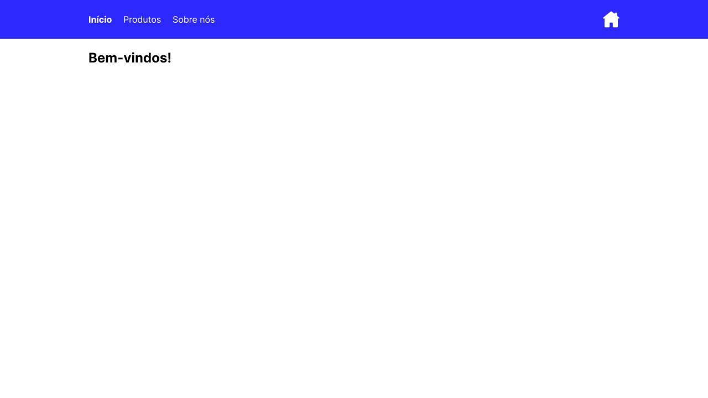
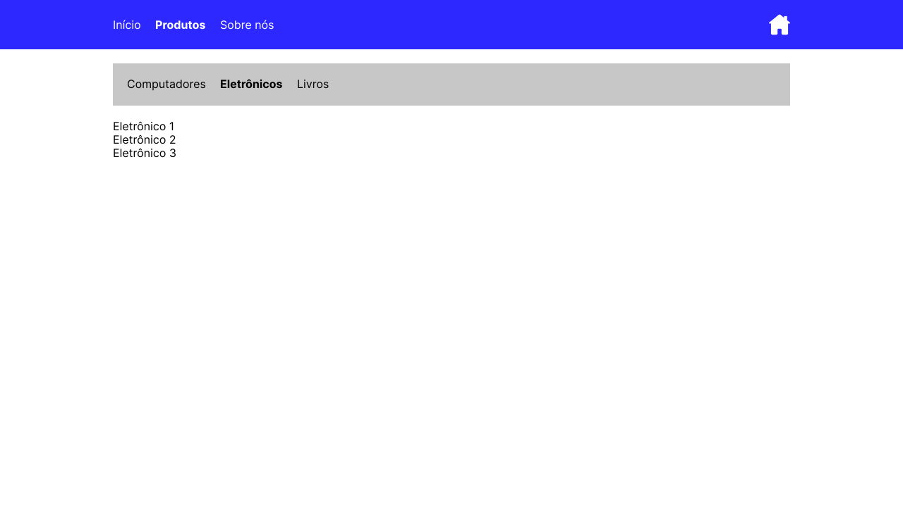
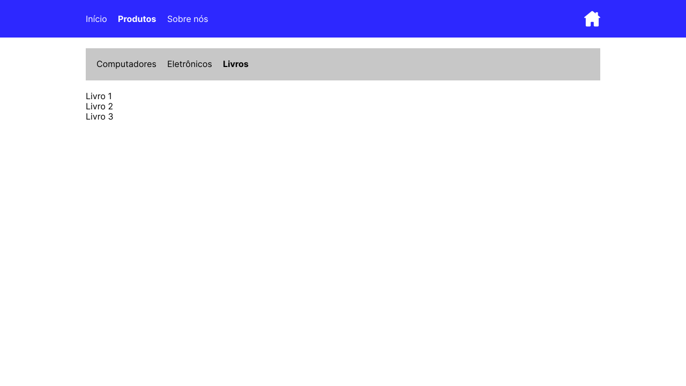
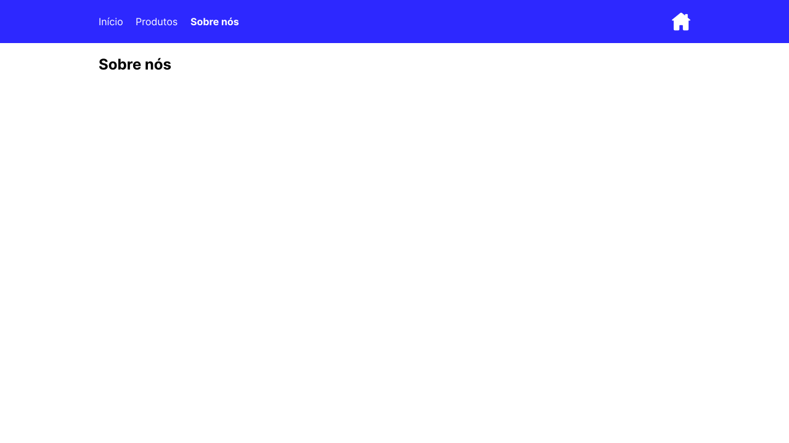
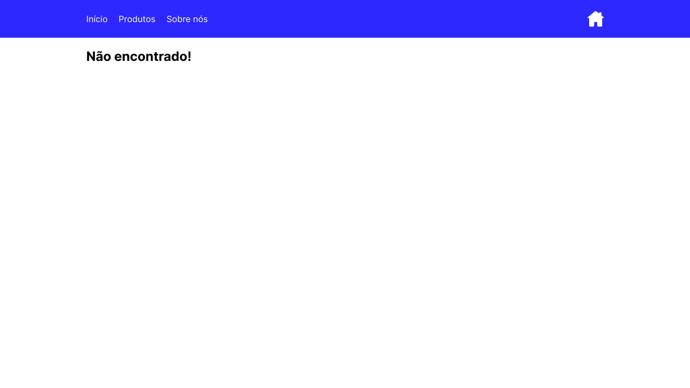

# Desafio: React Routes

## 🚀 Sobre o Projeto

Este projeto é um desafio focado em `"Rotas React"`, desenvolvido com as tecnologias [React](https://react.dev/), [TypeScript](https://www.typescriptlang.org/) e [Vite](https://vitejs.dev/). Ele faz parte do treinamento de reciclagem e aprimoramento chamado **ReactJS Professional**, oferecido pela escola [DevSuperior](https://devsuperior.com.br/). O principal objetivo é aprofundar e fixar os conceitos de Componentes e Rotas no desenvolvimento frontend com essas tecnologias.

## 🛠️ Tecnologias e Ferramentas Utilizadas

### Ambiente de Desenvolvimento:

- **Node.js**: Ambiente de execução JavaScript no servidor.
- **VSCode**: Editor de código-fonte utilizado para desenvolvimento do projeto.

### Principais Tecnologias:

- **React**: Biblioteca JavaScript para construção de interfaces de usuário.
- **Vite**: Ferramenta de construção que visa fornecer um meio mais rápido e eficiente de desenvolvimento para projetos modernos.
- **TypeScript**: Superset de JavaScript que adiciona tipagem estática.
- **React Router Dom v6.4.1**: Biblioteca para gerenciamento de rotas em aplicações React.

## 📦 Instalação e Uso

1. Primeiro, certifique-se de ter o `Node.js` instalado em sua máquina.
2. Clone o repositório para sua máquina.
3. Navegue até a pasta do projeto e execute o comando `yarn install` ou `npm install` para instalar todas as dependências.
4. Após a instalação, você pode iniciar o servidor de desenvolvimento com `yarn dev` ou `npm dev`.

A biblioteca específica de roteamento para este projeto, foi:

```bash
yarn add react-router-dom@6.4.1 @types/react-router-dom@5.3.3
```

## 📚 Características Principais

### Rotas Aninhadas e o Uso de `<Outlet />`

O projeto utiliza o conceito de rotas aninhadas para organizar a estrutura de navegação. Isso permite uma melhor organização e flexibilidade ao adicionar ou remover rotas. O componente `<Outlet />` da biblioteca, é usado para renderizar as subrotas dentro de um `componente pai`. Por exemplo, no componente `Products`, temos:

```jsx
export default function Products() {
    return (
        <div>
            <Category />
            <Outlet />
        </div>
    );
}
```

Aqui, `<Category />` renderiza os links de categoria e `<Outlet />` é o local onde as subrotas de produtos (como "computers", "electronics", etc.) serão renderizadas.

### Componente de Cabeçalho (Header)

Este componente é responsável pela navegação principal do aplicativo. Ele utiliza a propriedade `end` da `NavLink` para garantir que o link "Início" só esteja ativo quando estivermos na rota raiz.

```jsx
<NavLink
    to="/"
    end
    className={({ isActive }) => isNotFoundRoute ? "nav-link" : isActive ? "nav-link active-link" : "nav-link"}
>
    Início
</NavLink>
```

### Tratamento de Rotas Desconhecidas

Há uma rota especial (`<Route path="*" element={<NotFound />} />`) que captura qualquer URL que não reconhecida, e renderiza no componente `"NotFound"`. Além disso, quando esta rota é acionada, o foco dos links ativos é removido, garantindo que nenhum link pareça estar ativo.

### Configuração de Rotas Conhecidas

Para facilitar a manutenção e escalabilidade, as rotas conhecidas são armazenadas em um arquivo de configuração separado (`routesConfig.ts`). Isso permite adicionar ou remover rotas de uma única localização, sem ter que alterar múltiplos componentes.

## 🖼️ Apresentação das Telas (Rotas)

### Inicial

<div align="center">
  
</div>

### Produtos com Subcategoria Computadores

<div align="center">
  
</div>

### Produtos com Subcategoria Eletrônicos

<div align="center">
  
</div>

### Produtos com Subcategoria Livros

<div align="center">
  
</div>

### Sobre

<div align="center">
  
</div>

### Não Encontrado

<div align="center">
  
</div>

## 📖 Conclusão

Este projeto é uma excelente oportunidade para aprofundar os conceitos de rotas em React, especialmente com a API de rotas do React Router v6. A estruturação cuidadosa e a organização do código garantem que o projeto seja facilmente escalável e manutenível. Através deste estudo de caso, é possível entender a importância de uma boa estruturação de rotas e a flexibilidade que o `React Router v6` oferece para os desenvolvedores.